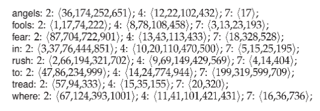

# 《信息检索》作业4

 计83李天勤2018080106

题目1：Shown below is portion of a positional index ...

对输入查询

1. "fools rush in"
2. "fools rush in" AND "angels fear dread"

分别给出相应返回的文档集。（注：双引号表示其内含查询词串应视作短语）

1. "fools rush in" : document 2, position 1; document 4, position 8; document 7, position 3, position 13
2. "fools rush in" AND "angels fear to tread"; document 4

题目2：参考课堂PPT中Heaps‘ Law相关内容。我们根据RCV1语科库统计数据，已经得到了Heaps’ Law如下两个参数 $ k = 44$ 和 $b=0.49$

Heaps Law is defined as 
$$
V = Kn^\beta
$$
where $V$ is the size of the vocabulary and $n$ is the length of the corpus in words (number of tokens in the collection)

那么，当同类语料库规模分别为1亿词，100亿词以及5000亿词时，对应的词典规模分别时多大呢？

$V = 44 * (100,000,000) ^ {(0.49)} = 365976.059$

$V = 44 * (10,000,000,000) ^ {(0.49)} = 3495044.23$

$V=44 * (500,000,000,000)^{(0.49)}=23765556$

