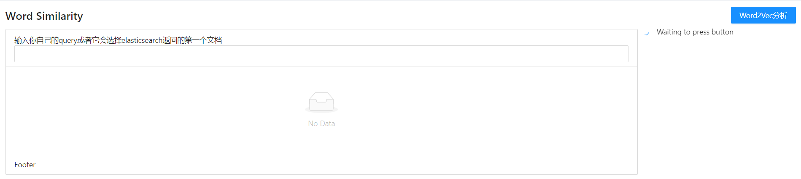

    <h1>
        信息检索 Elasticsearch Pt2
    </h1>

 计83 李天勤 2018080106

## Abstract

This homework is an extension of the previous Elasticsearch homework. Our goal add more functionality to our IR system by using more techniques that we had learned in the second half of the semester

## Background

This is what the experiment initially looked like. It only had basic Elasticsearch functionality which is based on Boolean search. It had two search relationships. If the tab displays 及, then the query has an AND relationship.  And the 或 describes an OR relationship. This is explained in the documentation 

## Implementation

I slightly changed the format of the page, and added a couple new functionalities. The first small addition is adding functionality that searches documents by its column. It uses Elasticsearch to match the column sections in the index.  

The document table is the same. 

### Word2vec Word Similarity

The following below are the three new functionality that I have added. The first is word similarity. It takes the documents returned by Elasticsearch and does word similarity on the documents.

It splits the request in three sections, and returns the time to read, train, and run. 

The request on the frontend is as such.

And the python backend is simply implements the functionality of word2vec.  For example, the train function is as such. The implementations for the following are similar.

### Doc2vec Document Similarity 

I used Gensim's Doc2vec to implement document similarity. You can enter your own document or query, or it will use the first result returned by elasticsearch. In word2vec, you train to find word vectors and then run similarity queries between words. In doc2vec, you tag your text and you also get tag vectors.  Then, after doc2vec training you can use the same vector arithmetic's to run similarity queries on author tags, which document are most similar to the one being queried. 

It returns the top 5 results

### Lsi Document Similarity 

Similar to document similarity, but still using LSI.

## Analysis

We can see from the results that Doc2Vec and LSI to compare each method. 

Using Elasticsearch, we queried the corpus and got back 10000 results

The result with the highest score is this Elasticsearch query is 

Then, to compare the methods, we can look at the results given. The algorithms and methods used for this extension are the same as  the homework for 6 and 7, and the conclusions are pretty much the same. LSI is a count based model where similar terms have same counts for different documents. Then dimensions of this count matrix is reduced using SVD. For both the models similarity can be calculated using cosine similarity. Word2vec is a prediction based model, for example, the given the vector of a word predict the context word vectors (such as skipgram method).  When utilizing a small window count, Doc2vec organizes results by terms that are 相似，while LSI organizes results by 相关. Training an LSI system takes much more time than Doc2vec on its basic window of 5, and with 5 epochs.

Compared to Doc2vec and LSI, Elasticsearch is much faster, and cheaper, and handles only pure and simple keyword searches. Thus, when handling simple keyword searches such as 清华 or 北京，Elasticsearch gives us a much better results when we search for documents with simple queries. 

Thus, when handling larger document based similarity searches (larger queries), it is better to use Doc2Vec or LSI methods. 

## Improvements

Based on this experiment, and throughout this class, it is easy to see how easy to hard it is to make a good IR system. There are a lot of things to consider. If I have more time to work on this experiment, I would like to have implemented more features, and tried more information retrieval methods, such as BERT, and do a deeper comparison between these methods and find a way to display the similarities and differences. I would also like to have improved the interface. 

Thanks! 