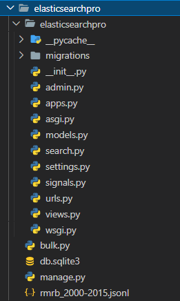
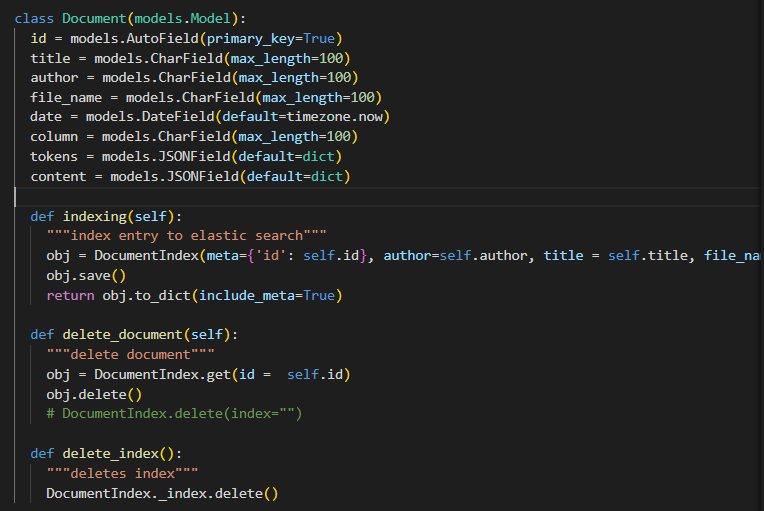
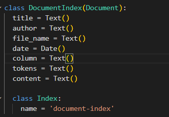
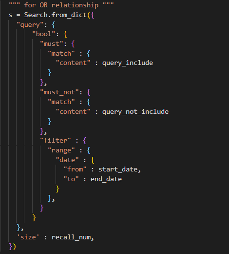
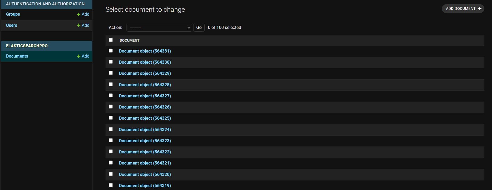
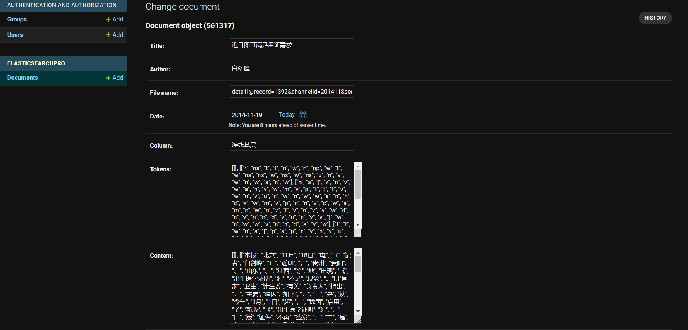
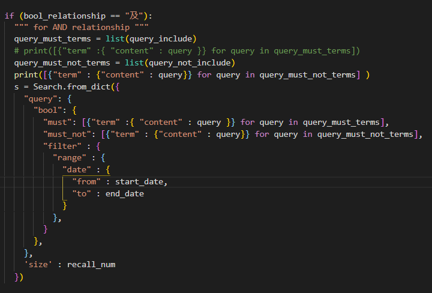
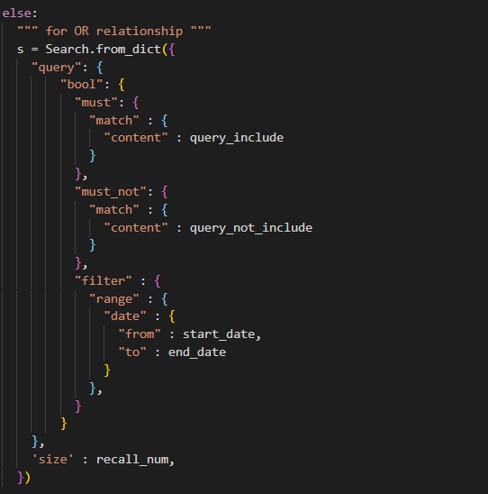
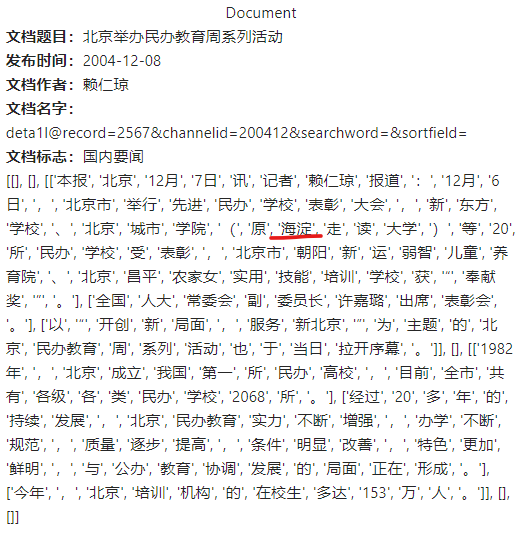

<center><h1>信息检索 Elasticsearch</h1></center>

<center>计83李天勤2018080106</center>

## 作业目标

实现一个信息检索系统Demo，要求有前端展示，用户可以输入关键词进行查询（不要求输入句子），并展示检索结果，并且要求使用适当的方式展示布尔查询（关键词查询、文档发布时间筛选）

## 实验环境

1. Linux 和 Conda 虚拟环境
2. elasticsearch 和 kibana (调试)
3. django 后端
4. react 和 ant design 前端

## elasticsearch

To test it's functionality, we run the most basic test

```
curl 127.0.0.1:9200
```

```
{
  "name" : "PowerEdge-R730",
  "cluster_name" : "elasticsearch",
  "cluster_uuid" : "FRA13faRSdSAWjBKZsxVeg",
  "version" : {
    "number" : "7.15.1",
    "build_flavor" : "default",
    "build_type" : "tar",
    "build_hash" : "83c34f456ae29d60e94d886e455e6a3409bba9ed",
    "build_date" : "2021-10-07T21:56:19.031608185Z",
    "build_snapshot" : false,
    "lucene_version" : "8.9.0",
    "minimum_wire_compatibility_version" : "6.8.0",
    "minimum_index_compatibility_version" : "6.0.0-beta1"
  },
  "tagline" : "You Know, for Search"
}
```

I ran my program on a server, and the frontend can be accessed at http://166.111.17.74:23700/

## 后端

```
python manage.py runserver
```

I used a Django as my backend framework to handle requests from the frontend and provide an API to handle the searching of documents in Elasticsearch. I used the library `elasticsearch_dsl` .

This is the hierarchy of my django project. I won't go too much into details about the Django framework, but I will describe the main parts.



`Models.py` contains the model definition for the documents after they are parsed. This model defines the SQLite tables. `Signals.py` contains functionality for automatically indexing each document into Elasticsearch every time a document is saved into Django's SQlite database. `Views.py` contains the API for the backend to handle requests and contains the core functionality for return the requested information back to the frontend.`Search.py` contains the data structure and functionality for Elasticsearch.  `Views.py` and `Search.py` work as such: 

1. First, the request `def read_corpus(request)` reads all entries from `rmrb_2000-2015.jsonl` saves all document information into SQLite as well as Indexing each document into Elasticsearch. As the documents are saved to SQLite,· `models.Document.save()`, a signal is sent to index the document into Elasticsearch, this is defined in `signals.py`. Our model is declared as 

   

2. The index is structured as such, 

   

   where I split up the tokens and words into two separate lists. This is how each document is indexed into Elasticsearch. 

3. The functions `def search(request)` and `def search_document_by_id` handle the search functions, one of them returning a list of results that contain characters to be matched, and the other one returning a specific document, respectively. `Elasticsearch_dsl` is extremely easy to use, a basic search function can be written as (located in `search.py`)

   

   As we can see, the query method is not much different then directly using `curl`, but this library provides a simple way to use it in python. 

4. Django then returns the list of documents to the frontend for display. 

I picked Django as my framework because I could use the admin page to directly manipulate and look at the entries (as each saved entry were also in the sqlite database). For example, 





However, there is a drawback to this method, since we use Django and the included SQLite database, we are effectively saving/indexing the documents twice, one into SQLite, and one in Elasticsearch, making storing the documents slower and more memory expensive. I also should have preprocessed `rmrb_2000-2015.jsonl` and split up the tokens and characters beforehand, doing it Django while saving is memory expensive. 


## 前端

```
npm start 
```

This is the temporary frontend design that I had developed using ReactJs, a javascript library for building user interfaces and Ant Design, a popular React UI framework.  I had worked with these frameworks before so it wasn't too hard to get the frontend started. The frontend is pretty basic. It has a date selector (发布时间）, which selects the date range that the documents are in, the number of documents to be returned （多少文档）, the words that have to be included in the search（包含查询）, and the words that are not included （不含查询）. It also has a switch for the type of "match", OR, or, AND. 


Let us do a basic search for the test query “检索发表于2003-2005年包含“北京”但不包含“海淀”的. This is the following response I get. 


From the results we can see that, there are greater than 10000 documents that matched the query, however, I only asked for 100 of them. The display shows the articles ordered by date. Before analyzing the results more carefully, I want to explain the 匹配关系 options. If the tab displays 及, then the query has an AND relationship.  And the 或 describes an OR relationship. This is explained in the documentation 


Where 及 represents the '多词匹配可以指定通史出现', while the 或 represents '多词匹配查询默认使用or关系'. The query structure can be found in `search.py.` The following is the ’及' query structure,



And the ‘或’  query structure.




And as we can see, we only looked to match the content of each document, nothing else. Now lets look at the results more specifically. For example, let us search for 北京 itself. 


Already we can see some different results as well as different scores that a returned. If we 阅读 ”北京举办民办教育周系列活动“, we can see that it does indeed contain the term 海淀



Let us try another example, 清华大学, we get the following results


However, let us try 清华大学仅不含大学


From this response, we can see the impact of the AND OR relationship, since we use the AND relationship that there are no queries that contain all the characters 清华大学 and does not contain 大学. Let us try with the OR relationship. 


As we can see, the documents returned do contain at least one of the terms in 清华大学. In this example document, it contains 清.   