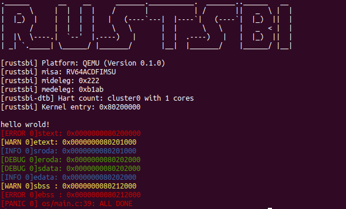

# ch1 - 应用程序域基本执行环境

计83李天勤201808106

## 实验目的

1. Understand framework of lab
2. 读懂os/kernel.ld和Makefile
3. make debug,自学gdb调试的方式

## 实验结果



## 问答作业

1. 请学习gdb调用工具的使用（这对后续调试很重要），并通过gdb简单跟踪从机器加电到跳转到0x80200000的简单过程，就需要描述重要跳转即可，就需要描述上qemu的情况。

首先我们用gdb看汇编，最开头0x1000那四五个执行. 0x80000000以后可直接看rustbi的源代码，不需要看gdb汇编了，但是我用break和continue看了这几个执行

```shell
$ make debug
0x0000000000001000 in ?? ()
Breakpoint 1 at 0x1000
(gdb) ni
0x0000000000001004 in ?? ()
1: x/12i $pc-8
   0xffc:	unimp
   0xffe:	unimp
   0x1000:	auipc	t0,0x0				# add upper immediate to pc
=> 0x1004:	addi	a1,t0,32			# add immediate
   0x1008:	csrr	a0,mhartid			# control status register read machine hardware thread id to a0
   0x100c:	ld	t0,24(t0)
   0x1010:	jr	t0						# jump to RustSBI_start(0x80000000)
   0x1014:	unimp
   0x1016:	unimp
   0x1018:	unimp
   0x101a:	0x8000					
   0x101c:	unimp
(gdb) break *0x80000000
(gdb) continue
Continuing.

Breakpoint 2, 0x0000000080000000 in ?? ()
1: x/12i $pc-8
   0x7ffffff8:  unimp
   0x7ffffffa:  unimp
   0x7ffffffc:  unimp
   0x7ffffffe:  unimp
=> 0x80000000:  csrr    a2,mhartid				# RustSBI_start
   0x80000004:  lui     t0,0x0
   0x80000008:  addi    t0,t0,7
   0x8000000c:  bltu    t0,a2,0x8000003a
   0x80000010:  auipc   sp,0x200
   0x80000014:  addi    sp,sp,-16
   0x80000018:  lui     t0,0x10
   0x8000001c:  mv      t0,t0
(gdb) ni
...
 0x0000000080000036 in ?? () # jump to RustSBI main
1: x/12i $pc-8
   0x8000002e:  sub     sp,sp,t0
   0x80000032:  csrw    mscratch,zero
=> 0x80000036:  j       0x80002572
   0x8000003a:  wfi
   0x8000003e:  j       0x8000003a
   0x80000040:  unimp
   0x80000042:  addi    sp,sp,-16
   0x80000044:  mv      a1,a0
   0x80000046:  sw      a0,8(sp)
   0x80000048:  sw      a0,12(sp)
   0x8000004a:  slli    a0,a0,0x20
   0x8000004c:  srli    a0,a0,0x20
(gdb) ni
[rustsbi] RustSBI version 0.1.1
.______       __    __      _______.___________.  _______..______   __
|   _  \     |  |  |  |    /       |           | /       ||   _  \ |  |
|  |_)  |    |  |  |  |   |   (----`---|  |----`|   (----`|  |_)  ||  |
|      /     |  |  |  |    \   \       |  |      \   \    |   _  < |  |
|  |\  \----.|  `--'  |.----)   |      |  |  .----)   |   |  |_)  ||  |
| _| `._____| \______/ |_______/       |__|  |_______/    |______/ |__|

[rustsbi] Platform: QEMU (Version 0.1.0)
[rustsbi] misa: RV64ACDFIMSU
[rustsbi] mideleg: 0x222
[rustsbi] medeleg: 0xb1ab
[rustsbi-dtb] Hart count: cluster0 with 1 cores
[rustsbi] Kernel entry: 0x80200000

Breakpoint 4, 0x0000000080002cce in ?? () # jump to enter+priveleged (0x80001504)
1: x/12i $pc-8
   0x80002cc6:  ld      a0,16(sp)
   0x80002cc8:  ld      a1,320(sp)
   0x80002cca:  auipc   ra,0xfffff
=> 0x80002cce:  jalr    -1990(ra)
   0x80002cd2:  unimp
   0x80002cd4:  addi    sp,sp,-464
   0x80002cd6:  sd      ra,456(sp)
   0x80002cd8:  sd      a0,400(sp)
   0x80002cda:  li      a1,0
   0x80002cdc:  sb      a1,399(sp)
   0x80002ce0:  mv      a1,a0
   0x80002ce2:  sd      a0,408(sp)
(gdb) ni
...
0x000000008000150e in ?? () # jump to RustSBI's mode_start (0x800023da)
1: x/12i $pc-8
   0x80001506:  sd      a0,0(sp)
   0x80001508:  sd      a1,8(sp)
   0x8000150a:  csrrw   sp,mscratch,sp
=> 0x8000150e:  mret
   0x80001512:  unimp
   0x80001514:  addi    sp,sp,-48
   0x80001516:  sd      ra,40(sp)
   0x80001518:  sd      a0,24(sp)
   0x8000151a:  sd      a1,32(sp)
   0x8000151c:  li      a2,0
   0x8000151e:  sd      a1,0(sp)
   0x80001520:  beq     a0,a2,0x80001534

0x00000000800023e2 in ?? () # jump to 0x802000000, the memory location where $KERNEL_BIN is located, and execute the first instruction of the operating system
hello wrold!
[ERROR 0]stext: 0x0000000080200000
[WARN 0]etext: 0x0000000080201000
[INFO 0]sroda: 0x0000000080201000
[DEBUG 0]eroda: 0x0000000080202000
[DEBUG 0]sdata: 0x0000000080202000
[INFO 0]edata: 0x0000000080202000
[WARN 0]sbss : 0x0000000080212000
[ERROR 0]ebss : 0x0000000080212000
[PANIC 0] os/main.c:39: ALL DONE
Remote connection closed
(gdb) quit
```

# 