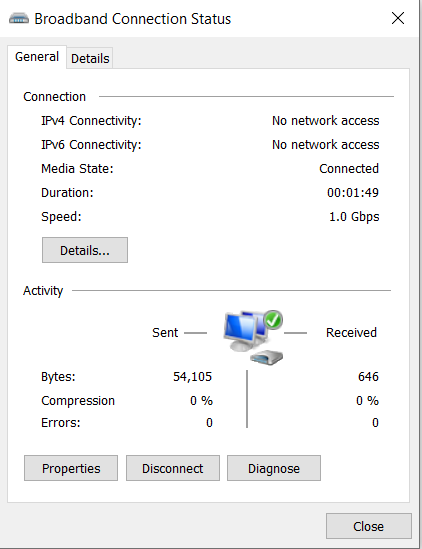
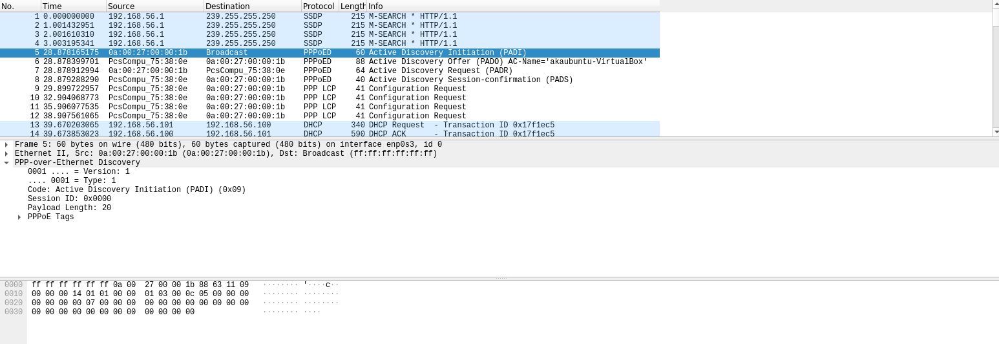
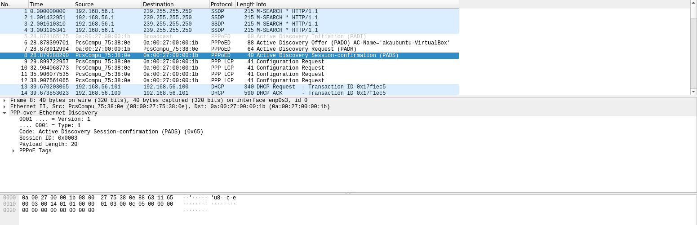
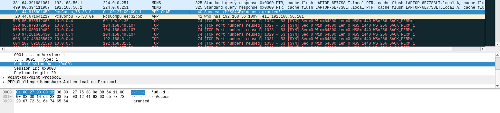
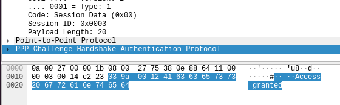
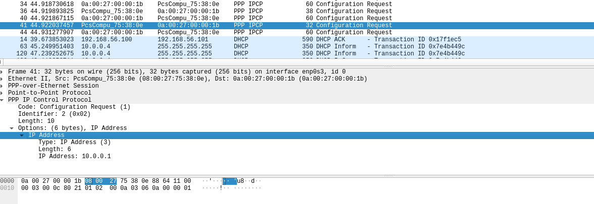

<center><h1>计算机网络原理 第三次作业</h1></center>

<center> 计 83 李天勤 2018080106 George Li</center>》

## 书面作业

1. An upper-layer packet is split into 10 frames, each of which has an 80% change of arriving undamaged. If no error control is done by the data link protocol, how many times must the message be sent on average to get the entire thing through?
   $$
   \text{all success} = 0.8^{10} \approx 0.107
   $$
   Let this value be p, the expected number of transmissions for entire message is
   $$
   E = \sum^\infty_{i=1}{ip(1-p)^{i-1}} = p\sum^\infty_{i=1}{i(1-p)^{i-1}}
   $$
   reducing this using well-known formula for the sum of an infinite geometric series gives us
   $$
   S = \sum^\infty_{i=1}{\alpha^i} = \frac{1}{1-\alpha}
   $$
   differentiate both sides with respect to $\alpha $
   $$
   S = \sum^\infty_{i=1}{i\alpha^{i-1}} = -\frac{1}{(1-\alpha)^2}, \because \alpha = 1-p, \therefore E=1/p = 1/0.107
   $$
   Therefore, it will take on average about 9.3 transmissions

2. The following character encoding is used in the data link protocol `A: 01000111 B: 11100011 FLAG: 01111110 ESC: 11100000` Show the bit sequence transmitted (in binary) for the four-character frame A B ESC FLAG when each of the following framing methods is used:

   (a) Byte count. (b) Flag bytes with byte stuffing. (c) Starting and ending flag bytes with bit stuffing

   (a) ``00000100`` `01000111` `11100011` `11100000` `01111110` 

   (b) `01111110`  `01000111` `11100011` `11100000` `11100000`  `01111110` `01111110` , put a esc in front of the "accidental flag", and flags to dictate start and end

   (c) `01111110`  `01000111`  `110100011`  `111000000`  `011111010`  `01111110` , add zero's whenever there five 1's in a row 

9. Sixteen-bit messages are transmitted using a Hamming code. How many check bits are needed to ensure that a receiver can detect and correct single bit errors? Show the bit pattern transmitted for the message `1101 0011 0011 0101`. Assume that even parity is used in Hamming Code 
   $$
   \text{Given m}, (m + r + 1) \leq 2^r
   $$
   puts a lower limit on the number of check bits needed to correct single errors.  Given that $m=16$, $r \geq 5$.  Thus, parity bits are needed at positions 1, 2, 4, 8, and 16 (01010)

   011010110011001110101

   

11. One way of detecting errors is to transmit data as blocks of n rows of k bits per row and add parity bits to each row and each column. The bit in in the lower-right corner is a parity bit that checks its row and its column. Will this scheme detect all single errors? Double errors? Triple errors? Show that this scheme cannot detect some four bit errors.

    【答】A single error will cause both the horizontal and vertical parity checks to be wrong. 

    - Two errors will also be easily detected, if in different rows, the row parity will catch them, and if they are in the same row, the column parity will catch them.
    - Three errors will also be detected. 
      - If they are in the same row or column, that row’s or column’s parity will catch them.
      - If two errors are in the same row, the column parity of at least one of them will catch the error. 
      - If two errors are in the same column, the row parity of at least one of them will catch the error. 
    - A 4-bit error in which the four error bits lie on the four corners of a rectangle cannot be caught.

20. A channel has a bit rate of 4 kbps and a propagation delay of 20 msec. For what range of frame sizes does stop-and-wait give an efficiency of at least 50%?

    【答】Efficiency will be 50% when the time required to transmit the frame is equal to the round-trip propagation delay. At a transmission of 4 bits/msc,  160 bits would take 40 msec.  Thus for frame sizes above 160 bits, stop and wait gives an efficiency of at least 50%.

21. In protocol 3,  is it possible for the sender to start the timer when it is already running? If so, how might this occur? If not, why is it impossible?

    【答】It is possible, suppose that the sender transmits a frame and acknowledgement comes quickly, the main loop will be executed a second time and a frame will be sent while the timer is still running.

22. A 3000-km-long T1 trunk is used to transmit 64-byte frames using protocol 5. If the propagation speed is 6$\mu \text{sec/km}$, how many bits should the sequence number be?

    【答】7 bit sequence is needed

32. Frames of 1000 bits are sent over a 1-Mbps channel using a geostationary satellite whose propagation time from earth is 270 msec. Acknowledgements are always piggybacked onto data frames. The headers are very short. Three-bit sequence numbers are used. What is the maximum achievable channel utilization for 

    (a) Stop-and-wait? (b) Protocol 5? (c) Protocol 6?

    【答】a) 0.18% b) 1.29% c) 0.74%

## PPPoE 实验

网络拓扑

- 客户端Windows
- 服务端Linux虚拟机 (Ubuntu 20.04 Virtual Box)

完成实验环境配置，启动PPPoE Server

```
ip a
```


```
sudo pppoe-server -I enp0s3 -L 10.0.0.1 -R 10.0.0.2 -N 20
```

然后测试

```
ps aux | grep pppoe-server
```


Windows 10 PPPoE Client

连接成功




## PPP协议

PPP protocol provides a standard for transmitting multi-protocol datagrams from point to point. It is convenient to use Wireshark for observation. 

### 实验目的

Grasp principles of PPP, understand the frame structure of PPP, and understand the three connections of PPPoE connection.

### 协议简介

PPP 协议有3各主要组成部分

1. 封装PPP报文的方法
2. 建立，配置和测试数据链路连接的LCP（LInk Control Protocol）协议
3. 建立和配置不同网层协议的NCP（Network Control Protocol 协议）

PPP is a connection oriented protocol

## 思考问题

1. 给出Wireshark捕获的PADS报文，PPP-CHAP response报文，PPP-IPCP request（携 带分配后地址的）报文截图，并指出PPP-CHAP response 中的加密摘要字段。

   PADI

   

   PADS

   

   PPP_CHAP response

   

   蓝色是加密摘要字段)

   

   PPP-IPCP Request

   

2. 在通常的以太网（MTU=1500）上，使用 PPPoE 协议传递 UDP 数据报（IP 头不包含可选字段）。每个报文可以携带的上层应用的数据容量至多为多少？解释计算过程。

   【答】1500-8(PPP header and tail overhead)-20(IP header)-8(UDP header)=1464

3. 观察捕捉的报文可以发现，用 PPPoE 封装的PPP帧头部不包含标志、地址和控制字 段，为什么？

   【答】Because the PPPoE protocol does not require address, flags, and control fields. 

4. PPP LCP 协商中的 MRU 值受到哪些因素的影响？

   【答】The value of MRU will be affected by the value of the local MTU

5. 查阅相关资料，说明应该如何在 PPPoE 链路上进行 IPv6 协议的配置，并给出涉及到 的协议名称、相关 RFC 编号。（本题不止一种方案，言之有理即可）

6. 你认为 PPPoE 有哪些优点和缺点？（开放式问题，言之有理即可）

   【答】Advantages: Relatively easy configuration, can track traffic usage status of each user

   Disadvantages: PPPOE protocol needs to be encapsulated in Ethernet frames again, so the encapsulation efficiency is low, resulting in a waste of bandwidth; the discovery phase also requires a large amount of broadcast traffic, which affects network performance; additional authentication is required.


