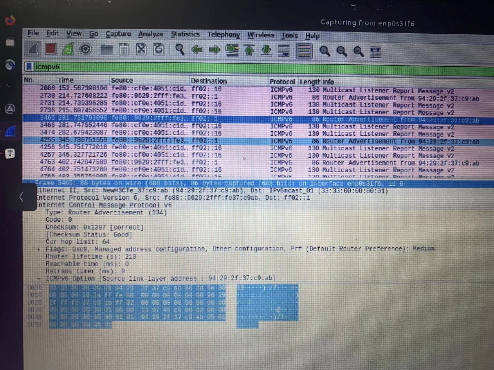

    <h1>
        网络原理 第4作业        
    </h1>

    计 83 李天勤 2018080106 George Li

## Computer Networks 5th Edition 书面作业

Page 257 - 354

2. A group of N stations share a 56kbps pure ALOHA channel. Each station outputs a 1000-bit frame on average once every 100 sec, even if the previous one has not yet been sent (e.g. the stations can buffer outgoing frames). What is the maximum value of N?

   【答】A pure ALOHA has a maximum efficiency of 18.4%.$.184 \times 56 =10.304 \space\text{kbps}$ . Each station needs 10 bits per second. Thus, $ N = 10304 / 10 = 1030 \text{ stations}$

13. What is the band rate of classic 10-Mbps Ethernet?

    【答】Classic Ethernet uses Manchester encoding, which means it has two signal periods per bit sent. Since data rate is 10Mbps, the baud rate is twice that, or 20 megabaud.

14. Sketch the Manchester encoding on a classic Ethernet for the bit stream 0001110101

    【答】我用的是IEEE 802.3标准， 0  goes from high to low ,   1 goes from low to high 

15. A 1-km long, 10 Mbps CSMA/CD LAN (not 802.3) has a propagation speed of 200 $m/\mu \text{sec}$. Repeaters are not allowed in this system. Data frames are 256 bits long, including 32 bits of header, checksum, and other overhead. The first bit slot after a successful transmission is reserved for the receiver to capture the channel in order to send a 32-bit acknowledgement frame. What is the effective  data rate, excluding overhead, assuming that there are no collisions

    【答】3.8 Mbps

18. Ethernet frames must be at least 64 bytes long to ensure that the transmitter is still going in the event of a collision at the far end of the cable. Fast Ethernet has the same 64-byte minimum frame size but can get the bits out ten times faster. How is it possible to maintain the same minimum frame size? 

    【答】Because the maximum wire delay in fast Ethernet is 1/10 as long as in Ethernet.

25. Suppose that an 11-Mbps 802.11b LAN is transmitting 64-byte frames back-to-back over a radio channel with a bit error rate of 10−7. How many frames per second will be damaged on average?

    【答】Frame has 512 bits.  Probability of none of them getting damaged is $(1-p)^{512} = 0.9999488$, thus the the percent getting damaged is $5 × 10^{−5}$. The amount of frames that will get damaged is $11*10^6 bits/sec * 5 * 10^{-5} = 510 bits/sec$, so about one frame per second.   

27. Give two reasons why networks might use an error-correcting code instead of error detection and retransmission.

    【答】One reason would be real-time service. If an error is discovered, there isn't any time for error to be fixed and retransmitted. Another reason, is that on low quality channels (wireless chines), there is a super high error rate, and thus retransmitted rates very likely also contain errors. Thus, instead of retransmitting, increasing the fraction of correct code, forward error correction is used to increase the fraction of frames that arrive correctly. 

## IEEE 802.3 协议实验

实验目的

1. 掌握IEEE 802.3协议原理，理解帧结构
2. 了解ARP和ND协议

### 4.1 IPv4 部分 （ARP 协议）

实验环境：Virtualbox上跑Ubuntu 20.04 

1. 查看实验主机IP地址和MAC地址

2. 查看ARP表项

3. 清楚所有ARP表项

观看捕获的数据帧，回答下列问题

1. 依次查看捕获的各数据帧，目的地为实验主机的数据帧中长度最小的是多大？查看这种帧的各个域，看看先导域是否包含在记录的数据中；记录的数据是从哪个字段开始，至哪个字段结束？这是否验证了IEEE 802.3标准中规定的最小帧长为64字节？

   

   

   

   Looking at the captured Ethernet packet, it is of the ARP protocol, with a length of 42. The ARP is 28 bits, and the type, source, and destination mac address are 14 bytes long, thus it only needs 42 bytes.

2. 查找捕获帧中长度最长的帧。可以多访问一些网页以捕获更多的帧，看看这些帧的长度最大是多大？为什么？

   After capturing, sorting from biggest to smallest, the biggest frame is TCP or HTTP, with a length of 1514. This is because when accessing the internet, sending files are very big. And thus the frames are very big.

3. 找到捕获帧中由实验主机发出的ARP请求（Request）帧，辨认其目的地址域和源地址域，参照图2。看看它的目的MAC地址是多少？

   

   

   From this we can see, that the ARP source address is 08:00:27:75:38:0e. From what we can see, these are both the same. 

4. 对比一下封装ARP分组的帧和其他帧（封装IP分组的帧），看看它们的类型字段分别是多少？

   

5. 在验证最小帧长的时候，选择的数据帧是目的地为实验主机的数据帧。如果选择由实验主机发出的数据帧则会发现，帧长度可能会比60字节还小，例如图2中的帧就只有42字节。试分析这种帧的各个域，并解释这一现象。

   The ARP is 28 bits, and the type, source, and destination mac address are 14 bytes long, thus it only needs 42 bytes.

6. 上网查找资料，看看除了IP和ARP之外，还有哪些IEEE 802.3协议支持的网络层分组类型，编码分别是什么？列举一个。

   Another would be WoL, which has a code of 8100.

   

### 4.2 IPv6 部分（ND 协议）

We can see that it is no longer an open interface on Wireshark

Once turned on, we can see it running again

 

Then I realized, I could not connect to IPv6 on my laptop, and therefore not my virtualbox, so I switched to another computer running ubuntu.

1. 你观察到的ND报文有几种类型（Type）？这些报文的长度是多少？

   【答】I see three different types of ND packets

   	1. Neighbor Solicitation with 86 bits
   	1. Neighbor Advertisement with 86 bits
   	1. Router Advertisement with 86 bits

2. 你所在的网络中，路由器是否会周期性地发送其IPv6和MAC地址？如果是，发送周期大约是多少？

   【答】大概每一分钟会发一次

3. Router Solicitation（路由器请求，RS）和Router Advertisement（路由器通告，RA）报文的IPv6目标地址分别是多少，它们代表什么含义？RS和RA的以太网帧的MAC目标地址分别是多少，它们又代表什么含义？

   【答】ipv6地址为128bits

    	1. Router Solicitation 的 Type 为  133. It will send to the "All Router IPv6 Multicast Address" `FF02::2`. All layer 3 multicast addresses have a corresponding layer 2 mac address (`33:33:xx:xx:xx:xx`)
    	2. Router Advertisement 的 Type 为 134. It is  it is destined to the all-nodes multicast addresses (`FF02::1`). It uses the IPv6 link-local address as source

4. 观察并总结Neighbor Solicitation（邻居请求，NS）报文的IPv6目标地址的特点，查阅资料并解释IPv6 Solicited-Node Multicast Address如何计算。观察并总结RS、RA以及NS以太网帧的MAC目标地址的特点，查阅并解释IPv6 Multicast MAC Address如何计算

   

​		NS报文是用来判断邻居的链路层地址，以及重复地址检测. It has a Type of 135. Similar to Router Solicitation, send an NS message to the solicited-node multicast address of the target, that has the lower 24 bits from the IPv6 unicast address (`ff02::1:ff37:c9ab`)The message that is sent, `address`, for example,  Every layer 3 multicast address is mapped to a layer 2 multicast MAC address (`33:33:xx:xx:xx:xx`), where xx:xx:xx:xx are the last 32 bits of the solicited-node multicast address. The lower 32 bits came from an IPv6 solicited-node multicast address, which i s`ff37:c9ab`

