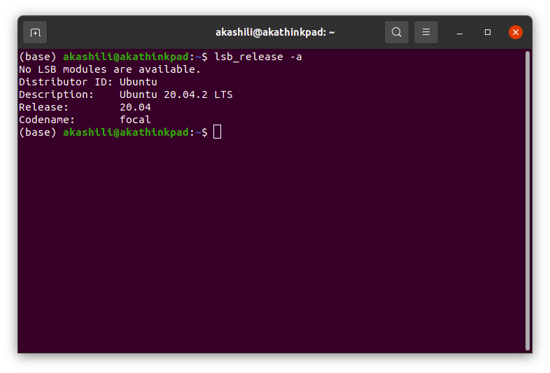

    <h1>
        计算机网络管理 第5作业
    </h1>

    计83 李天勤 2018080106

## 书面作业

第五章：2，3，9，10，22，28，34，40，42

2. Primitives of transport service assumes asymmetry between the two end points during connection establishment, one end (server) executes LISTEN while the other end (client) executes CONNECT. However, in peer to peer applications such file sharing system, e.g BitTorrent, all end points are peers. There is no server or client functionality. How can transport services primitives may be be used to build such peer to peer applications. 

   【答】Since both of the endpoints are peers, and since they can act as both servers and clients, we may need a separate mechanism that will tell us which will act as a client and which will act as a server at run time. One method is having a separate coordinator process that provides this information to the end points before connections is established.

3. In the underlying model of Fig. 6-4, it is assumed that packets may be lost by the network layer and thus must be individually acknowledged. Suppose that the network layer is 100 percent reliable and never loses packets. What changes, if any, are needed in 6-4? 

   【答】The dashed line that go through state PASSIVE ESTABLISHMENT PENDING to ESTABLISHED is no longer dependent on acknowledgement arriving. The transition can happen immediately. Thus, we can remove PASSIVE ESTABLSHMENT PENDING state because it will never happen.

9. Imagine that a two-way handshake rather than a three-way handshake were used to set up connections. In other words, the third message was not required. Are deadlocks now possible? Give an example or show that none exist

   【答】Deadlocks are definitely possible. For example, if a packet arrives at host A, and A acknowledges it but that acknowledgement gets lost, A is now open but B is unaware of what happened. Now, if the same thing happens to B, both are open and expecting different sequence numbers. 

10. Imagine a generalized n-army problem, in which the agreement of any two of the blue armies is sufficient for victory. Does a protocol exist that allows blue to win?

    【答】No the problem is essential the same as the two army problem. 

22. What is the total size of the minimum TCP MTU, including TCP and IP overhead but not including data link layer overhead?

    The total size of the minimum TCP MTU， or MSS + TCP + IP = 536 + 20 + 20 = 576 Bytes

28. The maximum payload of a TCP segment is 65,495 bytes. Why was such a strange number chosen?

    【答】Absolute limitation on TCP packet size is 64K, or 65535 bytes. Since this most be incorporated into IP packet with an IP header of 20, and with a TCP header of 20, the space left for data is only 65,495 bytes.

34. What is the fastest line speed at which a host can blast out 1500-byte TCP payloads with a 120-sec maximum packet lifetime without having the sequence numbers wrap around? Take TCP, IP, and Ethernet overhead into consideration. Assume that Ethernet frames may be sent continuously.

    【答】The TCP, IP, and Ethernet headers have overhead of 20, 20, and 26 bytes, respectively. Thus for each 1500 bytes of payload, 1566 bytes must be sent. Our goal is to send 2^32 bytes in 120 seconds. This is 23,860 1500 byte frames/sec. Thus, we need a line of  2 ^ 32 * 8 * 1566 / 1500 / 120 = 299Mbps.

40. In Sec. 6.6.5, we calculated that a gigabit line dumps 80,000 packets/sec on the host, giving it only 6250 instructions to process it and leaving half the CPU time for applications. This calculation assumed a 1500-byte packet. Redo the calculation for an ARPANET-sized packet (128 bytes). In both cases, assume that the packet sizes given include all overhead. 

    【答】With a packet 11.72 times smaller, you get 11.72 times as many per second, so each packet only gets 6250/11.72 or 533 instructions.

42. Calculate the bandwidth delay product for the following networks: 

    【答】

    1. T1 (1.5 Mbps) - 18.75 KB
    2. Ethernet (10 Mbps) - 125 KB
    3. T3 (45 Mbps) - 562.5 KB
    4. STS-3 (155 Mbps) - 1.937 MB

    Assume an RTT of 100msec. Recall that a TCP header has 16 bits reserved for Window Size. What are its implications in light of your calculations? 【答】A window size of 16 bit means that a sender can send at most 64KB before having to wait for acknowledgement. This means that a sender cannot continuously use TCP if other network tecknolwedges are used. 

    

# 实验：IP，ICMP及ND观察实验

## 实验环境

## IP协议

### 观察普通IP分组

### 观察IP分片重组

分片扩展头Fragment Header

抓到包

- ping每次（每秒）发出的若干IP分组有带分片扩展头，其中的identification直一样的
- 他们的MF直是1，代表Yes，0代表No
- offset有0也有1488 Bytes

思考题`

1. 观察traceroute程序发送的一系列分组中的Hop Limit字段，他们有何特点？

   【答】They all have a hop limit of 64. Linux has a default HOP count of 64. 

2. ICMP，TCP，UDP以及分片扩展头对应的Next Header之分别是多少（请回答四个十进制整数）

   【答】ICMP has a next header of of 58,  6 for TCP, 17 for UDP, and 44 for 分片扩展头

3. 分片扩展头（若有）在一个IP分组的什么位置，即从第几个字节开始到第几个字节结束？不带有和带有分片扩展头时，上层协议的有效载荷（payload）分别从第几个字节开始？（请回答四个十进制整数，从0开始数）

   【答】Since the IPv6 header is always 40 Bytes, the first IPv6 extension headers, if present, starts from byte 40. Thus for a fragment header, The IPv6 fragment header is 64 bytes long, thus ending at 104 bytes. which is The Ipv6 packet payload is the combination of the IPv6 extension headers and the upper layer PDU. It can be up to 65,535 bytes long. If there is no fragment header (or no other extension header), then the payload should directly start at 40

4. 什么情况下IP分组需要分片？在哪里分片？又是在哪里重新组装起来的？

   【答】If the IP packet is longer than the MTU of the forwarding interface when the IP protocol is transmitting data packets, the data packet will be divided into several fragments for transition. The receiver completes the reorganization. 

5. 阅读RFC8200: Internet Protocol, Version 6 (IPv6) Specification，了解IPv6定义的扩展头（Extension Header）除了分片扩展头还有哪些，Next Header值以及功能分别如何，列举两个。

   【答】A Next Header field field in the IPv6 header indicates the next extension header. Within each extension header is a Next Header field that indicates the next extension header. The last extension header indicates the upper layer protocol contained within the upper layer protocol data. Two values include 0x43 for routing header and 0x59 for next header.

## ICMP协议

## 观察ICMP回显请求及回显应答

1. ICMP消息标准
2. 请求与应答的标志符，序列号，数据都完成

### 观察ICMP目标不可达消息

### 观察ICMP超时消息

因为-t3没有超时，我是用-t2

`Time exceeded: Hop limit`表示什么？这次`ping` 操作是否成功获得对方主机的应答？【答】如果收到的包的hop limit等于0的话，包会被丢弃。但是，如果包到目的地址时hop limit等于0，应该正常处理包。看下面的结果就知道没有收到对方主机的应答。

1. 捕捉的分组显示实验者主机受到了ICMP超时消息，请确认ICMP消息的各个字段与标准是否一致：ICMP消息正确

思考题

1. 前文观察的ICMP目标不可达消息的Code字段值的多少，代表什么含义? 

   【答】In the Destination Unreachable message, the Type field is set to 1 and the Code field is set to a value in the range 0 through 4. If the code value is 0, it means no route to destination. If code is 1, communication with destination is prohibited by administrative policy. If the code is 2, that means the destination is beyond the scope of the source address. If value is 3, then the address is unreachable. If 4, that means port is unreachable. 

2. 前文观察的ICMP目标不可达消息以及超时消息的Unused字段之后的数据是什么内容？

   【答】Following the Checksum field is the Unused field and the leading portion of the discarded packet, so the size of the entire IPv6 packet containing the ICMPv6 message is no longer than 1280 bytes (The minimum IPv6 MTU)

3. 前文观察的ICMP目标不可达消息以及超时消息分别由谁发送？

   ​	【答】The ICMP Destination unreachable message is sent by a router in response to a packet which it cannot forward because the destination or next hop is unreachable

4. 为什么有些类型的ICMP消息（例如目标不可达消息）中有一个Unused字段，而另一些（例如回显消息）则没有？注意他们的长短，分析这样设计可能处于什么考虑？

   【答】 It depends on the size of the extension headers present. For example, an ICMPv6 message without extension headers, up to 1280 packets of the discarded packet are included in the message, and the ICMP6 unused segment remains. 

## ND 协议

### 观察地质解析（Address Resolution）过程及ND报文格式

### 观察Router Advertisement以及DAD

思考题

1. 查阅相关文献，在实验者所使用的系统中，哪一个选项控制另据缓存表项状态由REACHABLE变为STALE的超时时间（Reachable Time)?

   【答】According to the neighbor reachability time, the neighbor status changes from REACHABLE to STALE, meaning that the reachability of the nodes is uncertain. If in the REACHABLE state, A receives an Unsolicited Address from B, and the link layer address of B in the message is different from entry in the table, the neighbor status immediately changes to Stale.

1. 前文观察的源地址部位未指定地址的组播Neighbor Solicitation会带由源链路层地址（Source Link-Layer Address）选项，对应的Neighbor Advertisement也会带有目标链路层地址（Target Link-Layer Address）选项。然而，前文观察的单播Neighbor Solicitation及其对应的Neighbor Advertisement有时可能不带这样的选项（与实验环境有关），这是为什么？

   The corresponding Neighbor Advertisement does not have to contain a target link-layer address in response to a unicast NS because a unicast NS would mean that the NS would already know the target link-layer address. However, a multicast NS is sent to everyone, and thus does not necessarily know the target link-layer address, and thus the target must send a unicast NA that contains the target link-layer address.

2. Router Advertisement报文中的M（Managed address configuration)标志以及O（Other configuration）标志分别是什么含义？

   【答】The M flag says to the host recieve the RA advertisement that somewhere in its network there is a DDHCPv6 server availible and he should send a DHCPv6 request out of his interface to get his IPv6 address. If the flag is 0, we say the flag is cleared and the host will not try to get his address from DHCPv6 server. The O flag says that the host should se DHCP to get other configuration parts like DNS server IPv6 address or something else. 

3. 前文观察的源地址为未指定地址的组播Neighbor Solicitation是否有对应的Neighbor Advertisement？这说明了什么问题？

   【答】The multicast address of the Neighbor Solicitation message is the solicitated node multicast address derived from target IP address. It contains the link layer address of the sending host in the source link layer address option. When target receives this message, it updates its own neighbor cache. Next, the target node sends a unicast Neighbor Advertisement to the NS sender, which contains the target link-layer address option, which means its an option that is not really optional. 
