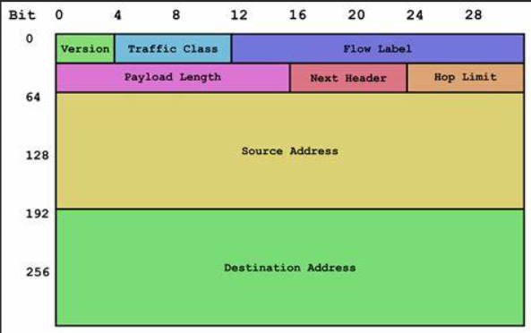
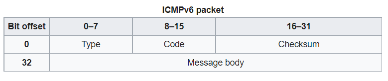
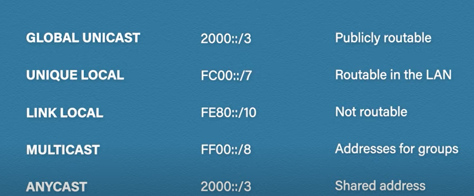

# 编程编程作业

Routing Lab： https://lab.cs.tsinghua.edu.cn/router/doc/requirement/
RIPng for IPv6

# 实验编程

一共包括四个编程实验，

- eui64：基于 EUI64 构造 IPv6 Link Local 地址
- internet-checksum：进行 UDP 和 ICMPv6 的校验和检验和计算
- lookup：路由表的查询
- protocol：RIPng 协议的处理

这都是什么？

# 实验要求

## 必须实现的有：

1. 转发功能，支持直连路由和间接路由，包括 Hop Limit 减一，查表并向正确的 interface 发送出去。
2. 周期性地向所有端口发送 RIPng Response（周期为 5s，而不是 RFC 2080 Section 2.3 Timers 要求的 30s），目标地址为 RIPng 的组播地址。
3. 对收到的 RIPng Request 生成 RIPng Response 进行回复，目标地址为 RIPng Request 的源地址。
4. 实现水平分割（split horizon）和毒性反转（reverse poisoning）。
5. 收到 RIPng Response 时，对路由表进行维护，处理 RIPng 中 metric=16 的情况。
6. 对 ICMPv6 Echo Request 进行 ICMPv6 Echo Reply 的回复，见 RFC 4443 Echo Reply Message。
7. 在接受到 IPv6 packet，按照目的地址在路由表中查找不到路由的时候，回复 ICMPv6 Destination Unreachable (No route to destination)，见 RFC 4443 Section 3.1 Destination Unreachable Message。
8. 在 Hop Limit 减为 0 时，回复 ICMPv6 Time Exceeded (Hop limit exceeded in transit)，见 RFC 4443 Section 3.3 Time Exceeded Message。
9. 在发送的 RIPng Response 大小超过 MTU 时进行拆分。

## 可选实现的有（不加分，但对调试有帮助）：

1. 定期或者在更新的时候向 stdout/stderr 打印最新的 RIP 路由表。
2. 在路由表出现更新的时候立即发送 RIPng Response（完整或者增量），可以加快路由表的收敛速度。
3. 路由的超时（Timeout）和垃圾回收（Garbage Collection）定时器。
4. 程序启动时向所有 interface 发送 RIPng Request。

## 不需要实现的有：

1. NDP 的处理，已经在 HAL 中实现。
2. interface 状态的跟踪（UP/DOWN 切换）

## 本地测试

pcap格式？

# Homework

## Internet Checksum

Fixed Header for IPv6 Packet

Unlike IPv4, IPv6 header does not contain a checksum. IPv6 was designed to speed up packet fowarding. In order to do so, the IPv5 header was greatly simplified and has a fixed length. IPv6 packets cannot be fragmentted the same way you can for IPv4, as fragmentation is resource intensive.

Not having a checksum in the IPv6 header means that the IPv6 router does not need to recalculate the checksum to see if the packet header is corrupt, and recalculate the checksum after decrementing the hop count. This saves processing time and speeds up packet fowarding. This is because L2 and L4 protocols each already have checksum. The L4 protocols each already have a checksum. The L2 checksum covers the entire IPv6 packet, and L4 checksum covers the entire IPv6 packet, L4 checksum covers transport diagram

Where UDP has an optional checksum for IPv4, it is required for IPv6

User Datagram Protocol is a transport layer protocol that provides integrity verification of the header and payload through checksum. The method used to compute it is documented in [RFC 2460](https://datatracker.ietf.org/doc/html/rfc2460)

https://stackoverflow.com/questions/30858973/udp-checksum-calculation-for-ipv6-packet?

Internet Control Message Protocol version 6 is a L2 protocol used by network devices to send error messages and operational information that indicates success or failure when communicating with another IP address.

https://en.wikipedia.org/wiki/IPv6_packet#Fixed_header

https://en.wikipedia.org/wiki/User_Datagram_Protocol#UDP_datagram_structure

## eui64

construct ipv6 link local address based on eui64

extended unique identifier is a method we can use to automatically configure IPv6 host addresses. An IPv6 device will use the MAC address of its interface to generate a unique 64-bit interface ID. However, a MAC address is 48 bit and the interface ID is 64 bit.

- link local - quick, automatic, private IP addresses that are not routable over an internet

What we do.

1. Take the MAC address and split into two pieces
2. Insert "FFFE" in between the two pieces so that we have a 64 bit value
3. We invert the 7th bit of the interface ID

## lookup

Goals

1. insertion and deletion of entries of routing table
2. query the routing table, return wheter it is found, if it is, write nexthop and if_index

There are a total of n lines of input data, each line represents an operation

1. l, followed by a string seperated by four spaces corresponds to 'addr' 'len' 'if_index' and 'nexthop'
2. D, followed by string seperated by two spaces, corresponding to 'addr' and 'len', means deletion
3. Q, the next ipv6 address means to be queried

Each row in the output data corresponds to each row in the input. For `I` or `D` operations, the code will first determine whether the input information `addr` and `len` are legal, if they are illegal, output `Invalid`, if legal, output `Valid` and perform the actual insertion or deletion . For the input `Q` operation, the routing table will be queried. If the query is found, `nexthop` and `if_index` will be output, otherwise `Not Found` will be output. You don't need to deal with input and output in your code.

可视化bian'huan 面积dai'kuan

1. Analyze the formats of IPv6, UDP and RIPng, and save useful information
2. If the legal data is obtained in the previous step, restore the RIPng transmission format from the saved information
3. Insertion and deletion of routing table
4. Query the routing table, return whether it is found, if it is found, write nexthop and if_index

There are a total of $n$ lines of input data, each line represents an operation, if the first character is `I`, followed by a string separated by four spaces corresponds to `addr` `len` `if_index` and `nexthop`, Indicates insertion; if the first character is `D`, followed by a string separated by two spaces, corresponding to `addr` and `len`, it means deletion; if the first character is `Q`, the next IPv6 address indicates The IPv6 address to be queried.

Each row in the output data corresponds to each row in the input. For `I` or `D` operations, the code will first determine whether the input information `addr` and `len` are legal, if they are illegal, output `Invalid`, if legal, output `Valid` and perform the actual insertion or deletion . For the input `Q` operation, the routing table will be queried. If the query is found, `nexthop` and `if_index` will be output, otherwise `Not Found` will be output. You don't need to deal with input and output in your code.

In terms of the amount of data in this question, all scores can be obtained by implementing a linear look-up table. We believe that online courses are not algorithm courses and should not have high basic requirements in terms of performance. However, in the later stages of actual routers, there may be performance differences between linear look-up tables and better look-up table algorithms.

IPv6

- 128 bits, hexidecimal
- 4 bits per hexidecimal
- eight 16 bit sections (0x0000-0xffff) (hextets)

formats

- omission of leading zeroes
- omission of all-zeroes hextets with :: (only one allowed)
- combine both of above

network vs host

len_to_mask converts

- prefix to mask

ipv6 mask -

IPv6 Prefix (compared to subnet mask of IPv4)

- https://networklessons.com/ipv6/how-to-find-ipv6-prefix/
- provided by IANA/RIR/ISP - global routing prefix 48 bits, subnet 16 (local assigned)
- https://www.youtube.com/watch?v=8IqXQ88QXfc&ab_channel=ProfessorMesser

https://stackoverflow.com/questions/7158528/is-there-any-code-for-bitwise-and-ipv6-address-and-network-mask-prefix

https://stackoverflow.com/questions/523724/c-c-check-if-one-bit-is-set-in-i-e-int-variable

https://techhub.hpe.com/eginfolib/networking/docs/switches/WB/16-01/5200-0135_wb_2920_ipv6/content/ch06s04.html

https://docs.netgate.com/pfsense/en/latest/network/ipv6/subnets.html

https://networklessons.com/ipv6/how-to-find-ipv6-prefix/

# protocol

RFC 2080: RIPng for IPv6

Two Goals of this Exam

1. Analyze IPv6, UDP, and RIPng, and save useful information
2. If legal data is obtained in the previous step, restore RIPng transmission format from the saved information

Routing Information Protocol (RIP) is an interior gateway protocol that uses a distance-vector algorithm to determine the best route to a destination, using the hop count as the metric. For IPv4, there are two versions (1 nd 2).

RIPng or RIP next generation, is an extension of RIPv2 for IPv6. The main differences include

1. RIPng does not support authentication, IPv65 routers, were, at the time, supposed to use IPsec
2. RIPv2 encodes the next-hop into each route entry, while RIPng requires specific encoding of the next hop for a set of route entries.
