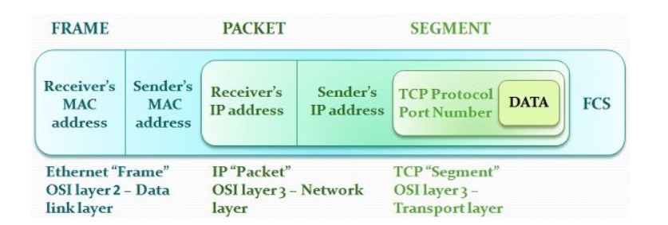

# Lecture 3 2021年9月28日

OSI参考模型

1. 物理层 - 硬件
2. 数据链路层 - Frame
3. 网络层 - Packet
4. 传输层 - 端到端数据传送（进程 - 进程）
5. 会话层 - 控制服务（比如checkpoint）
6. 表示层 - 提供数据转换和表示服务
7. 应用层 -

网络中不同的位置的硬件（端）实现不同的功能

- 网络层 - 路由器
- 数据链路层 + 物理层 在网卡上

在有差错的物理线路上

TCP参考模型 - Internet网络体系结构

1. Host to Network
2. Internet层 - 原点到目点IP包发送
3. 传输层
4. 应用层
   学习中，host to network模型分成物理层和数据链路层

OSI的问题

1. 太晚提出osi体系结构，互联网已经发布了
2. 技术问题，模型太复杂，比如需要6，7次的数据赋值效率比较低，协议问题

- 现在ipv6链路层已经能做以前osi网络层的检查

3. 协议标准，管理不好，

网络连接，传递信息，最重要

# 其他网络结构

- netware 共享文件，而当时只有磁盘共享 - 更安全。。。
- atm 对上层的应用支持不好，需要一个atm adaption layer，不好在互联网

# 总结

1. SAP - Service Access Points (location where one member of osi layer can request services of another layer)
2. SDU
3. IDU
4. PDU

课题

1. 地址空间为3.4x10^38，IPV6避免了NAT的使用，IPv6改善了路由性能
2. BC
3. CD

# 第三章：数据通信基本原理

## 基础分析

傅里叶分析，信息为电磁信号，可以用时间（领域）的函数，和频率（领域）的函数来表示

1. 模拟信号（连续）vs 数字信号 （离散

带宽 - 按频率，和传输相关，但是不等价

信道的最带数据传输速率H. Nyquist 	$2Hlog_2V$，带宽为H，么秒采样2H次，信号电平分为V级

## 技术

编码 - 如何把二进制编程能传输的信号

信道 - 多路复用（多个用户同时用）

交换 -

frame，packet 区别

同步传输、异步传输 （synchronous and asynchronou transmission）

> the major differences is that in synchronous transmission, the sender and receiver should have synchronized clocks before data transmition, where as in asynchronous transmission does not require a clock, but adds a parity bit to before the transmission. Furthermore, the synchronous transmission uses synchronization characters while asynchronous method employs start/stop bits, in order to alert the modem when data are being sent and when are these transmissions are completed are known as message characters

信号发送方法：模拟，数字

数据编码级数：基带传输，baseband transmission， frequency bands, interval in frequency domain, designated uses/functions at diff frequency

- NRZ non return to zero?

数字数据的模拟传输，也称频带传输, frequency band transmission

- modulation, processing of changing the parameters of the carrier signal (a high frequency signal that can travel longer distances without being affected), in accordance with the instantaneous values of the modulating signal, helps original message travel farther, strehngthens the signal without changing original message
- demodulation

stop at 调制 modulation/demodulation
