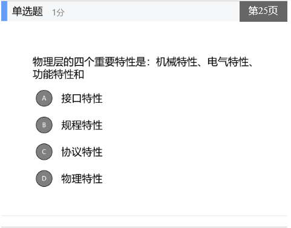
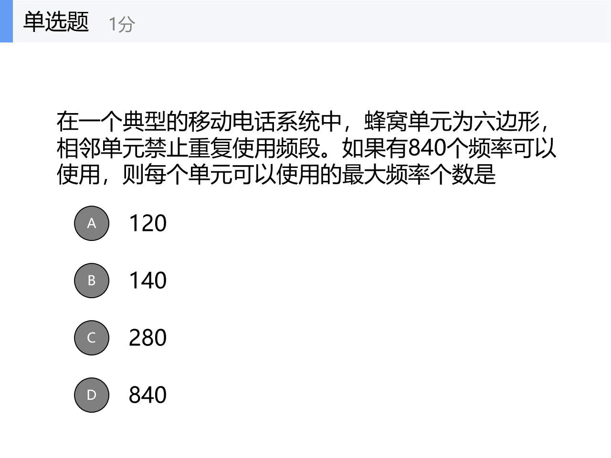

# Lecture 5 2021年10月11日

# 物理层

## 物理层的定义和功能

1. 机械特性 - 定义物理连接的边界点，比如连接插装置
2. 电气特性 - 规定传输二进制位时
3. 功能特性 - 规定各物理的物理线的功能
4. 规程特性 - 工作规程时序关系

Ex: 1. EIA RS-232-C * 物理层的协议

双绞线 - 模拟传输、数据传输都行，带宽 depends on the type of line and distance

1. UTP - unshielded twisted pair
2. STP - shielded twisted pair

同轴电缆 - not really used anymore

光纤 optical fiber- 短距离，便宜，但是单模支持距离比较长

光网络

## 网络传输技术

SONET/SDH - 复用速率

### 移动电话网络

单方向的寻呼系统

蜂窝电话 - 3G，4G

模拟蜂窝电话 - Push-to-talk

B

C. 280 - might be on test

# 第五章：数据链路控制及其协议

## 概述

如何在有差错的链路上，进行无差错传输

1. 链路上的建立，维护和释放
2. 物理上的数据分析，组帧
3. 误差控制

为网络层提供三种合理的服务

## 组

## 错组检测和

## 基本的数据链路层协议
