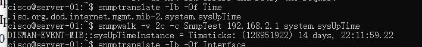
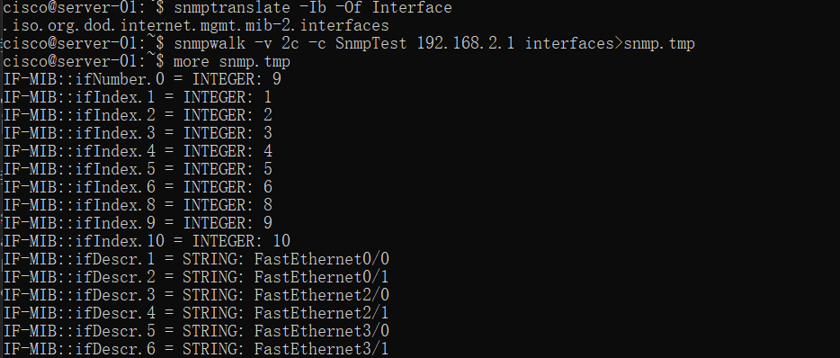
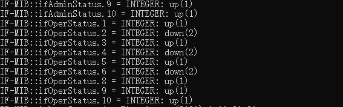
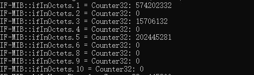
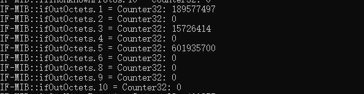
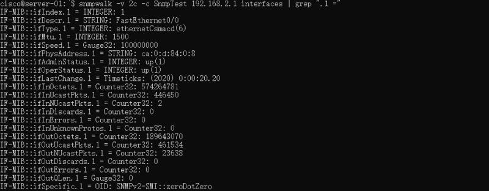
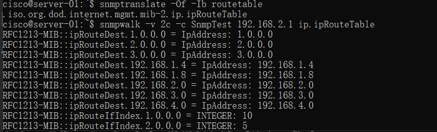
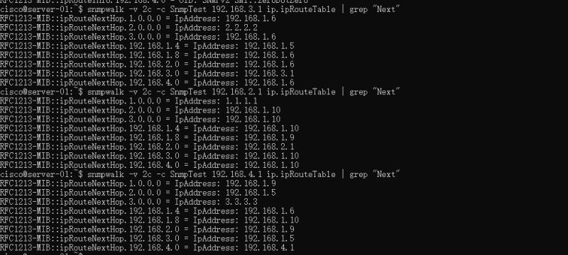

    <h1>
        SNMP 网管实验
    </h1>

    组2：李天勤，吴国昊，张雪莹，张舒翔

# 实验内容

1. 学习SNMP简单网络管理协议工具的使用
2. 了解SNMP网络管理基本操作

# 步骤

## 一，了解Net-SNMP工具包的使用方式

我们使用server-01为例

## 二，获取路由器开机时间

我们可以看出，这个机器做实验14天之前开机的。

## 三，获得路由器所有接口并给出相应的流量信息，并获取interface f0/0的所有相关消息

我们受限需要查找接口在MIB树种的名称，查到以后，我们使用snmpwalk。snmpwalk 用于自动运行多个 GETNEXT 请求。 SNMP GETNEXT 请求用于查询已启用的设备并从该设备获取数据。 它允许用户将请求链接在一起，而不必为子树中的每个 OID 或节点输入唯一的命令。 这使我们能够从每个连接的节点收集信息。

然后我们可以用grep获取interface f0/0的所有相关信息

从这些信息，我们可以看出来这个机器的很多信息。比如

1. IfIndex - 每个接口的唯一值，范围在 1 到此设备上存在的网络接口总数之间
2. IfDescr -通常标识接口的制造商、产品和硬件接口版本的文本字符串
3. IfType - 接口的接口类型的数字表示
4. IfAdminStatus - 接口的期望状态，其中 1 代表 up 状态
5. 等等

## 四，获取路由起的路由表，并确定网络拓扑

用snmptranslate来获取路由表在MIB树中的名称，在用snmpwalk获取路由表

用grep来过滤输出

根据以上的信息，我们可以得到拓扑图

