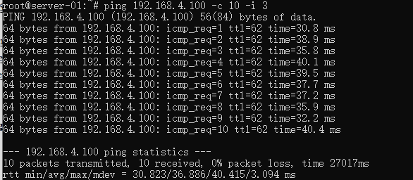
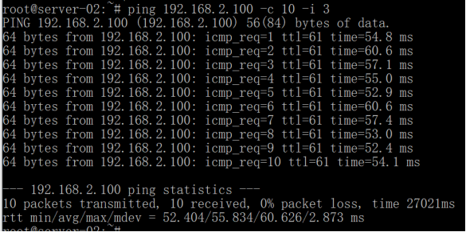
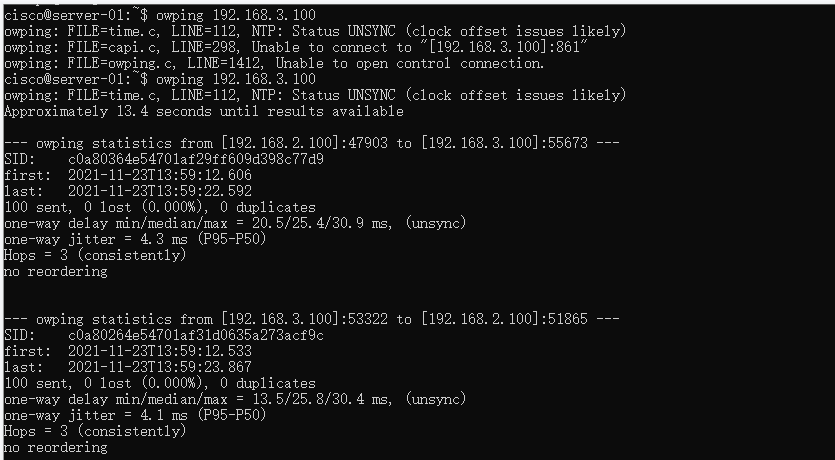

    <h1>
        实验3：路由器操作实验
    </h1>

    组2：李天勤，吴国昊，张雪莹，张舒翔

## 步骤一：网络拓扑测量

用ping -R来测试，然后画出拓扑图

### S1 ping -R S2和S3

| ping S2                                                      | ping S3                                                      |
| ------------------------------------------------------------ | ------------------------------------------------------------ |
|  |  |

### S2 ping -R S1和S3

| ping S1                                                      | ping S3                                                      |
| ------------------------------------------------------------ | ------------------------------------------------------------ |
|  |  |

### S3 ping -R S1和S2

| ping S1                                                      | ping S2                                               |
| ------------------------------------------------------------ | ----------------------------------------------------- |
|  |  |

三个结果综合起来，画出拓扑结构

## 步骤二：延时测量工具：双向延时ping 和 owping

### S1 ping S2和S3

| ping S2                                                      | ping S3                                                      |
| ------------------------------------------------------------ | ------------------------------------------------------------ |
|  |  |

### S2 ping S1和S3

| ping S1                                                      | ping S3                                                      |
| ------------------------------------------------------------ | ------------------------------------------------------------ |
|  |  |

### S3 ping S1和S2

| ping S1                                               | ping S2                                               |
| ----------------------------------------------------- | ----------------------------------------------------- |
|  |  |

### S1 owping S2和S3

| owping S2                                             | owping S3                                                    |
| ----------------------------------------------------- | ------------------------------------------------------------ |
|  |  |

### S2 owping S1和S3

| owping S1                                                    | owping S3                                                    |
| ------------------------------------------------------------ | ------------------------------------------------------------ |
|  |  |

### S3 owping S1和S2

| owping S1                                             | owping S2                                             |
| ----------------------------------------------------- | ----------------------------------------------------- |
|  |  |

### 思考题

1. 有时第一次ping的延时明显比以后的延时大得多。这种情况会影响测量结果的准确性吗？你认为出现这种情况的原因是什么？如何避免这种情况的发生？【答】第一个ping延时比较高因为arp lookup, 第一个ping需要在arp表找到适合的arp地址。不会影响测量结果的准确性。
2. 用2中的方法测量Server到默认网关的延时。你发现了什么现象？你认为产生这种现象的原因是什么？【答】S1和S2之间的延时比S1/S2和S3之间的延时高，因为S1和S2之间的路由器多（3个hops）。

结论：用ping来测试，我们定义了`-i` 和`-c` 两个参数。`-i` 指定发送的回显请求消息的 IP 标头中的生存时间 (TTL) 字段的值。`-c`指定ping的次数。owping或单向ping用来测试单向延迟测试。看结果，owping的延时差不多是ping的一半。

### 步骤三：测量带宽工具：iperf（端到端吞吐量）和pchar（逐跳带宽）

### S1 iperf S2和S3

| iperf S2                                                     | iperf S3                                                     |
| ------------------------------------------------------------ | ------------------------------------------------------------ |
|  |  |

### S2 iperf S1和S3

| iperf S1                                                     | iperf S3                                                     |
| ------------------------------------------------------------ | ------------------------------------------------------------ |
|  |  |

### S3 iperf S1和S2

| 第一次：iperf S1 and S2                               | 第二次：iperf S1 and S2                               |
| ----------------------------------------------------- | ----------------------------------------------------- |
|  |  |

用iperf来测试端到端吞吐量我们可以看到S1和S2之间的吞吐量低相对较小，S1/S2和S3之间的吞吐量会高一些。hos次数越少，吞吐率将显着提高。

### S1 pchar S2和S3

| pchar S2                                                     | pchar S3                                                     |
| ------------------------------------------------------------ | ------------------------------------------------------------ |
|  |  |

### S2 pchar S1和S3

| pchar S1                                                     | pchar S3                                                     |
| ------------------------------------------------------------ | ------------------------------------------------------------ |
|  |  |

### S3 pchar S1和S2

| pchar S1                                              | pchar S2                                                     |
| ----------------------------------------------------- | ------------------------------------------------------------ |
|  |  |

pchar是用来测量两个主机之间的网络路径的特征，是通过将不同大小的 UDP 数据包发送到网络并等待 ICMP 消息响应来测量网络吞吐量和往返时间，比iperf看到的信息多。S1和S2之间路径有4个hops，S1/S2和S3之间只有三个。结果和iperf一样，S1/S2和S3之间的吞吐量会高一些,化的时间end time - start time也会少一点（大概3秒，S1和S2之间大概4秒）。

### 步骤四：tcdump

S1

S2

S3

tcpdump会描述和给出网络接口上数据包内容。`tcpdump`会显示收到包的时间，协议（IP），发送者，，收货者。然后是TCP的flags。我们可以看第一个没有flags,除了ack. 第二个包的Flags包括P（Flags[P,]), 这代表PSH或PUSH，用于要求接收端不要缓存数据包，而是在收到后立即处理。“seq”是数据包中的序列号以及该数据包之后的下一个数据将具有的序列号。“ack”是数据包中的确认号。 默认情况下，tcpdump 显示相对于初始序列号的序列号和确认号。“长度”是 TCP 段中数据的长度。

tcpdump空困时间和iperf时的对比：iperf时会抓到很多包。但是iperf的丢包也多。

